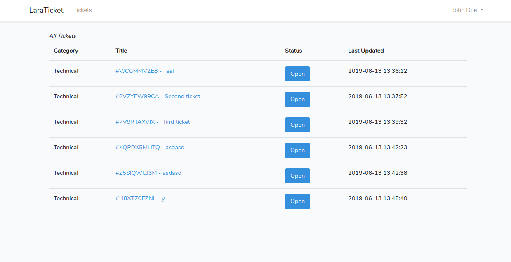

# Support Ticket


An support ticket application built using the Laravel framework.

## Getting Started

Clone the project repository by running the command below if you use SSH

```git clone https://github.com/Aleksandar-Mitic/support-ticket.git```

## Setting Up
Setup your database and `cd` into the project directory then run:

```php artisan migrate```

Once the database is setup and migrations are up, run

```php artisan serve```

and visit [http://localhost:8000/](http://localhost:8000/) to see the application in action.
